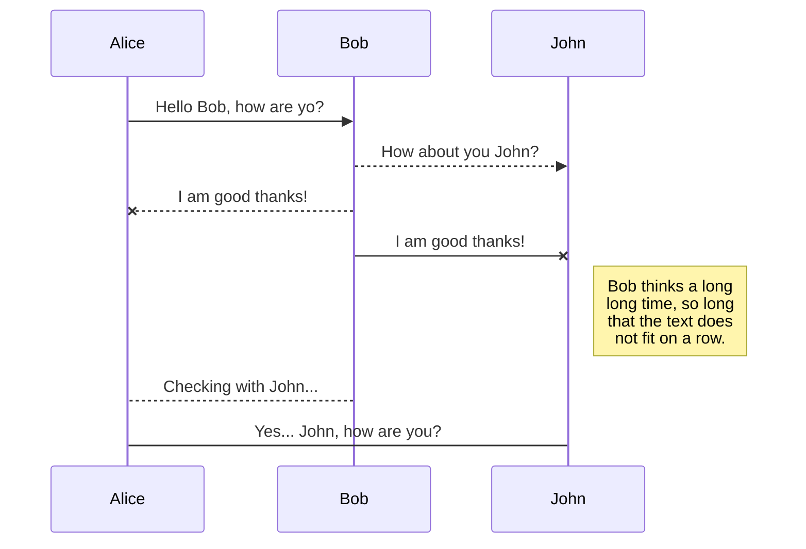
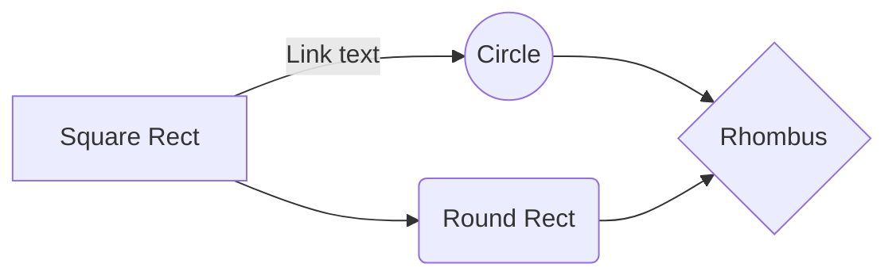

# Gridoto.com Dokumentasi Backend

## Tabel Konten

  * [Teknologi](#teknologi)
	  * [PHP](#php)
	  * [Python](#python)
	  * [MySQL](#mysql)
	  * [Redis](#redis)
	  * [Elasticsearch](#elasticsearch)
	  * [Amazon Web Services](#amazon-web-services)
		  * [Amazon S3](#amazon-s3)
		  * [Amazon Redis](#amazon-redis)
		  * [Amazon RDS](#amazon-rds)
  * [Diagram Alur](#diagram-alur)
     * [Article](#article)
     * [Menu](#menu)
  * [Author](#author)
  * [License](#license)

## Diagram Alur

Diagram alur gridoto di bagi menjadi 2 bagian, **article** dan **menu**. Pada **article** di jelaskan mekanisme alur gridoto dari mulai redaksi menulis berita, hingga sampai di halaman depan. Pada **menu** di jelaskan mekanisme alur gridoto dari mulai redaksi mengubah / menambah menu, hingga sampai di halaman depan.

### Article

### Menu

## Files

StackEdit stores your files in your browser, which means all your files are automatically saved locally and are accessible **offline!**

# Publication

Publishing in StackEdit makes it simple for you to publish online your files. Once you're happy with a file, you can publish it to different hosting platforms like **Blogger**, **Dropbox**, **Gist**, **GitHub**, **Google Drive**, **WordPress** and **Zendesk**. With [Handlebars templates](http://handlebarsjs.com/), you have full control over what you export.

> Before starting to publish, you must link an account in the **Publish** sub-menu.

### Publish a File

You can publish your file by opening the **Publish** sub-menu and by clicking **Publish to**. For some locations, you can choose between the following formats:

- Markdown: publish the Markdown text on a website that can interpret it (**GitHub** for instance),

## SmartyPants

SmartyPants converts ASCII punctuation characters into "smart" typographic punctuation HTML entities. For example:

|                |ASCII                          |HTML                         |
|----------------|-------------------------------|-----------------------------|
|Single backticks|`'Isn't this fun?'`            |'Isn't this fun?'            |
|Quotes          |`"Isn't this fun?"`            |"Isn't this fun?"            |
|Dashes          |`-- is en-dash, --- is em-dash`|-- is en-dash, --- is em-dash|

## KaTeX

You can render LaTeX mathematical expressions using [KaTeX](https://khan.github.io/KaTeX/):

The *Gamma function* satisfying $\Gamma(n) = (n-1)!\quad\forall n\in\mathbb N$ is via the Euler integral

$$
\Gamma(z) = \int_0^\infty t^{z-1}e^{-t}dt\,.
$$

> You can find more information about **LaTeX** mathematical expressions [here](http://meta.math.stackexchange.com/questions/5020/mathjax-basic-tutorial-and-quick-reference).

## UML diagrams

You can render UML diagrams using [Mermaid](https://mermaidjs.github.io/). For example, this will produce a sequence diagram:

And this will produce a flow chart:

## Author
Gridoto developer developer@gridoto.com.

## License
Gridoto di rilis di bawah naungan [Grid](http://www.grid.id).
